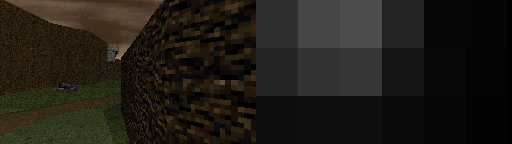

ViZDoomDepth
==========
This repository is for depth prediction for ViZDoom.

## Requirement
- Ubuntu or Mac OS
- Python 2.7
- Tensorflow==1.4+

## Demo Preview

`python demo.py`

The script will take `images/1.png` as input and output the result to `images/_prediction.png`. The result is as below:

## More Details
 To be announced.

## Full Release Date
- To be released on 30 Dec. 2018.

